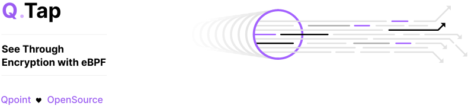
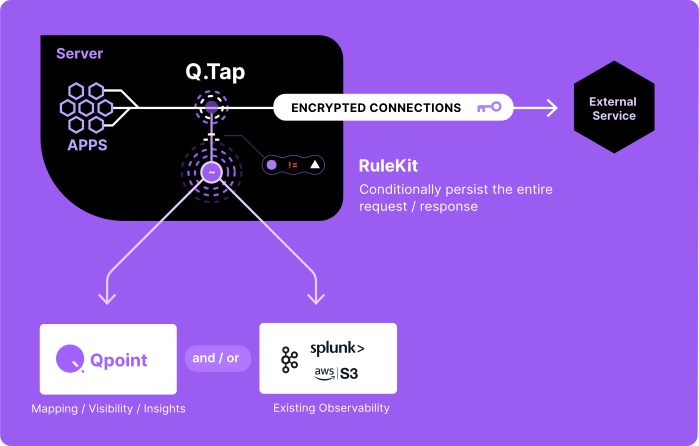

<br/>
<picture>
  <source media="(prefers-color-scheme: dark)" srcset="./readme-assets/qtap-header-dark.svg">
  <source media="(prefers-color-scheme: light)" srcset="./readme-assets/qtap-header-light.svg">
  
</picture>


----------

<div align="center">
    <a href="https://qpoint.io">
        
    </a>
    <a href="https://docs.qpoint.io">
        
    </a>
    <a href="https://github.com/qpoint-io/qtap/stargazers">
        
    </a>
    <a href="https://github.com/qpoint-io/qtap/actions/workflows/ci.yaml?query=branch%3Amain">
        
    </a>
    <a href="https://github.com/qpoint-io/qtap/blob/main/LICENSE">
        
    </a>
</div>

<br />

An eBPF agent that captures traffic flowing through the Linux kernel. By attaching to TLS/SSL functions, data is intercepted before and after encryption and then passed to flexible plugins with full visibility along with all of the available context - process/container/host/user/protocol/etc. Qtap makes it possible to understand what's happening with your egress traffic, without modifying apps, installing proxies, or managing certs.

<br />

Qtap shows you exactly what data is being sent and received in its original, unencrypted form while operating out-of-band with minimal overhead, without adding latency or disrupting application performance.

<br/>
<picture>
  <source media="(prefers-color-scheme: dark)" srcset="./readme-assets/qtap-overview-dark.svg">
  <source media="(prefers-color-scheme: light)" srcset="./readme-assets/qtap-overview-light.svg">
  
</picture>
<br/><br/><br/>

Qtap can augment your existing observability piplines or can be used as a foundational component for a custom solution, like [Qpoint](https://www.qpoint.io), in a variety of ways, including:

- **Security auditing** - Security professionals can verify sensitive data isn't being unintentionally exposed in network communications.
- **Debugging network issues** - When APIs return errors or connections fail, seeing the actual data being sent helps identify misconfigured parameters, malformed requests, or unexpected responses.
- **API development** - Developers can verify their applications are sending correctly formatted requests and properly handling responses without modifying code.
- **Troubleshooting third-party integrations** - When integrating with external services, Qtap helps confirm what data is actually being exchanged versus what documentation claims.
- **Learning and exploration** - Understanding how protocols actually work by observing real traffic between applications and services.
- **Legacy system investigation** - When working with poorly documented or legacy systems, Qtap provides insights into how they communicate without requiring source code access.
- **Validation testing** - Confirming that application changes don't unexpectedly alter network communication patterns.

<br />


For more information [see the "How It Works" section of our website](https://docs.qpoint.io/readme/how-it-works).

## Quick Start
Want to give Qtap a test run? Spin up a temporary instance in Demo mode! See the traffic in real time right in your terminal.

```bash
# Run Qtap in demo mode
$ curl -s https://get.qpoint.io/demo | sudo sh
```

Or install and start running right away!

```bash
# Install the Qtap agent
$ curl -s https://get.qpoint.io/install | sudo sh

# Run with defaults!
$ sudo qtap
```

## Community

Converse with Qpoint devs and the contributors in [Github Discussions](https://github.com/qpoint-io/qtap/discussions).

## Requirements

- Linux with Kernel 5.10+ with [BPF Type Format (BTF)](https://www.kernel.org/doc/html/latest/bpf/btf.html) enabled. You can check if your kernel has BTF enabled by verifying if `/sys/kernel/btf/vmlinux` exists on your system.
- eBPF enabled on the host.
- Elevated permissions on the host or within the Docker container running the agent:
    - on host run with `sudo`
    - within docker it's best to run with `CAP_BPF`, host pids, and privileged. For example:
    ``` bash
    docker run \
        --user 0:0 \
        --privileged \
        --cap-add CAP_BPF \
        --cap-add CAP_SYS_ADMIN \
        --pid=host \
        --network=host \
        -v /sys:/sys \
        --ulimit=memlock=-1 \
        us-docker.pkg.dev/qpoint-edge/public/qpoint:v0 \
        tap \
        --log-level=info
    ```

## Development
### Prerequisites
#### OS

- linux (kernel 5.8+)
    - MacOS developers at Qpoint have enjoyed using [Lima](https://lima-vm.io/) as a quick, easy linux VM for development.

#### Tools:
- go1.24+
- make
- clang14
- clang-tidy (optional/recommended)

### Quick Start
```bash
$ git clone https://github.com/qpoint-io/qtap.git
$ cd agent/
$ make build
```

#### Popular `Makefile` targets
These are the most commonly used targets by Qpoint devs:

- `build` - generates the eBPF binaries and builds the Go application
- `generate` - generates the eBPF binaries
- `run` - runs a debug instance of the Qtap
- `ci` - runs all of the ci checks (nice to use before pushing code)

## Project Status

This project is currently in early development. We're excited to share our work with the community and welcome your feedback! While we're actively improving things, please note that:

- Some APIs may change as we refine our approach
- Documentation might be incomplete in places
- There may be rough edges we haven't smoothed out yet

We welcome contributions through GitHub issues and appreciate your understanding that we're a small team balancing multiple priorities. We value constructive feedback that helps us make this project better.

Thank you for checking out our work!

## Licensing

This project is dual-licensed under AGPLv3.0 (for open source use) and a commercial license (for commercial use).

<picture>
  <source media="(prefers-color-scheme: dark)" srcset="./readme-assets/qpoint-open.svg">
  <source media="(prefers-color-scheme: light)" srcset="./readme-assets/qpoint-open-light.svg">
  
</picture>

## Contributing

By submitting contributions to this project, you agree to the [Contributor License Agreement](./.github/CLA.md). This agreement allows us to include your contributions in both the open source and commercial versions.
